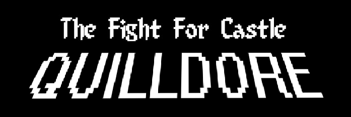

    

<h3 align="center">Castle Quilldore</h3>

  <a href="../../issues">Report an Issue</a>
  ·
  <a href="../../releases">Releases</a>
  ·
  <a href="/CHANGELOG.md">Change Log</a>

  <a href="#Description">Description</a>
  ·
  <a href="#Roadmap">Roadmap</a>

## Description
My first ever website... Written in 2012, Castle Quilldore is an RPG designed to utilise a lot of new (for 2012) features introduced in HTML5.  

Help the brave knight Drakhelm find his way through Castle Quilldore to battle the evil King Krillarg. An HTML5 based create your own adventure game for all ages.

## Roadmap
Date | Issue | Status |
:--: | ----- | ------ |
16/05/2021 | Switch to Bootstrap 5 | incomplete |
16/05/2021 | Change to PHP to stop the excessive amounts of code repetition | incomplete |
